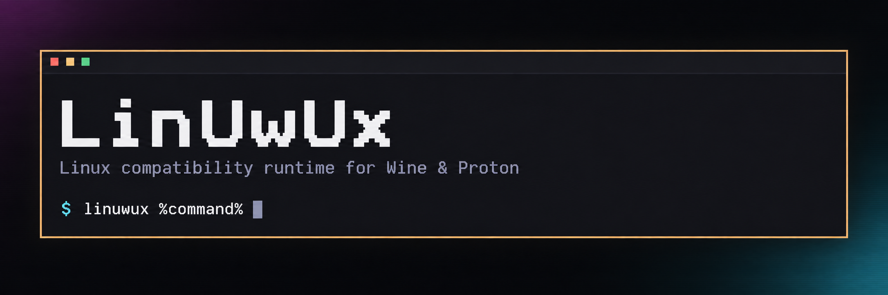

# LinUwUx

LinUwUx is a small Linux compatibility runtime for Windows games running through
Wine or Proton. It uses `LD_PRELOAD` to keep the CPU profile, Windows shared
system data, clocks, signal handling, and Wine environment consistent across the
game and its child processes.

It does not replace Proton or modify game files and prefixes. The installer adds
a `linuwux` wrapper which goes in front of the normal launch command.

## Why Rust?

The original LinUwUx was written in C. I mostly work with C++, so Rust felt
familiar while catching more mistakes at compile time. That is useful in code
which deals with signals, raw pointers, shared state, CPU registers, and libc
interposition.

Some `unsafe` code is unavoidable, but Rust keeps those boundaries visible. The
release library still has no garbage collector, uses `no_std`, exports a C ABI,
and compiles to a small native shared object.

## Requirements

Valve Proton, Proton Experimental, GE-Proton, and UMU-managed builds should all
work. The host needs:

- x86-64 Linux with glibc 2.34 or newer
- a 64-bit Wine/Proton host process or modern WoW64 setup
- working `LD_PRELOAD` support
- access to the installed library from inside any launcher sandbox

Native 32-bit Wine processes cannot load the 64-bit library and may print a
`wrong ELF class` warning.

### CPU and kernel prerequisites

LinUwUx needs UMIP disabled and CPUID faulting available. Check both flags first:

```sh
grep -m1 '^flags' /proc/cpuinfo | tr ' ' '\n' | grep -E '^(umip|cpuid_fault)$'
```

- `umip` means UMIP is enabled and needs to be disabled.
- `cpuid_fault` means native CPUID faulting is available and no emulation module
  is needed.

As a rough guide, Intel 9th generation and AMD Ryzen 3000 or newer CPUs normally
need UMIP disabled. AMD Ryzen AM4 CPUs up to the Ryzen 5000 series, including the
Steam Deck, normally need the `cpuid_fault_emulation` DKMS module as well. Trust
the flags over the model name.

#### Disable UMIP

If `umip` is listed, add this to your kernel command line using your
distribution's bootloader instructions, then reboot:

```text
clearcpuid=514
```

Check it afterwards:

```sh
cat /proc/cmdline
grep -qw umip /proc/cpuinfo && echo 'UMIP is still enabled' || echo 'UMIP is not enabled'
```

This affects the whole system. The kernel documents `clearcpuid` as a debugging
aid and notes that it taints the kernel. Remove the parameter and reboot to undo
the change.

#### CPUID faulting on AMD

If `cpuid_fault` is missing on an AMD AM4 system or Steam Deck, install the
`cpuid_fault_emulation` DKMS module. It needs matching kernel headers and build
tools, DKMS, and AMD virtualization enabled in the firmware.

The LinUwUx installer does not provide this module. Get it from a source you
trust. Secure Boot systems must sign it with an enrolled key.

## Install

```sh
curl -fsSL https://raw.githubusercontent.com/brcly/linuwux-runtime/main/install.sh | bash
```

This installs:

```text
~/.local/bin/linuwux
~/.local/share/linuwux/LinUwUx.so
```

The default install needs no root access. If `~/.local/bin` is missing from
`PATH`, add this to your shell profile and sign out and back in:

```sh
export PATH="$HOME/.local/bin:$PATH"
```

Check the install with `command -v linuwux`. Run the installer again to update.

If you want bare `linuwux` to work from desktop launchers whose session `PATH`
does not include `~/.local/bin`, optionally install the launcher globally:

```sh
curl -fsSL https://raw.githubusercontent.com/brcly/linuwux-runtime/main/install.sh | bash -s -- --global
```

This asks for a sudo password and installs only the launcher in
`/usr/local/bin`; the library remains in your home directory.

Some desktop sessions, including UWSM-managed Hyprland sessions, replace the
user `PATH` after login. An `environment.d` file may be read but still not reach
Noctalia, Faugus, or other already-managed applications. Use the absolute path
in launcher settings, or use `--global` if you want the bare command.

## Steam

Add this under **Properties > Launch Options**:

```text
/home/USERNAME/.local/bin/linuwux %command%
```

`linuwux` is a command prefix. Put actual variables before it:

```text
PROTON_AVX=1 /home/USERNAME/.local/bin/linuwux %command%
```

For Flatpak Steam, use the full path if the command cannot be found:

```text
/home/USERNAME/.local/bin/linuwux %command%
```

The Flatpak must also be able to read
`/home/USERNAME/.local/share/linuwux/LinUwUx.so`.

## Gamescope and MangoHud

For normal launches, put `linuwux` before the game command:

```text
mangohud /home/USERNAME/.local/bin/linuwux %command%
MANGOHUD=1 /home/USERNAME/.local/bin/linuwux %command%
```

When Gamescope wraps the game, put `linuwux` before Gamescope. This keeps the
runtime loaded if Gamescope re-executes itself or rewrites the child environment:

```text
/home/USERNAME/.local/bin/linuwux gamescope -f -- %command%
/home/USERNAME/.local/bin/linuwux gamescope --mangoapp -f -- %command%
PROTON_AVX=1 /home/USERNAME/.local/bin/linuwux gamescope --mangoapp -f -- %command%
```

Putting `linuwux` after Gamescope loads it only in the game process.

The wrapper also drops any `gameoverlayrenderer.so` entry from an inherited
`LD_PRELOAD` when the wrapped command is `gamescope`, so Gamescope does not
re-inject a Steam overlay LinUwUx did not request.

## Other launchers

- **Faugus Launcher:** Edit the game, open **Tools > Launch Settings**, and set
  **Launch Argument** to `/home/USERNAME/.local/bin/linuwux`. Use **Launch
  Arguments**, rather than **Game Arguments**. Its built-in GameMode and MangoHud
  switches can stay enabled.
  For Gamescope, use `/home/USERNAME/.local/bin/linuwux gamescope --` as the
  launch argument.
- **Lutris:** Open **Configure > Advanced options > System options** and set
  **Command prefix** to `/home/USERNAME/.local/bin/linuwux`.
- **Heroic, Bottles, and other frontends:** Put `/home/USERNAME/.local/bin/linuwux` in the per-game
  **Wrapper** or **Command prefix** field.

For Flatpak launchers, use `/home/USERNAME/.local/bin/linuwux` and allow access
to the installed library. If a launcher only accepts environment variables, set:

| Name | Value |
| --- | --- |
| `LD_PRELOAD` | `/home/USERNAME/.local/share/linuwux/LinUwUx.so` |

The wrapper always loads the installed LinUwUx library and prepends it to any
existing `LD_PRELOAD` value. Use an absolute path without spaces or colons.

## Configuration

LinUwUx needs no extra variables by default.

| Variable | Behaviour |
| --- | --- |
| `PROTON_AVX=1` | Enables AVX flags for the resume-target profile |
| `LINUWUX_SYSCALL_HACK=1` | Clears Wine's `KUSER_SHARED_DATA.SystemCall` flag (direct syscall path). Opt-in per title; not implied by Reflex |
| `LINUWUX_REDIRECT_ALL=1` | Experimental: routes CPUID instructions from Wine system code through LinUwUx instead of allowing native pass-through |
| `LINUWUX_DEBUG=1` | Enables runtime diagnostics |
| `LINUWUX_LOG=/absolute/path.log` | Writes diagnostics to a private `0600` file |

`LinUwUx` is an internal process marker and should not be set manually.

The launched game executable (a non-`system32` `.exe`) gets CPUID trapping,
native DLL overrides, and `win32u` duplicate-`free` suppression. Wine helpers
only append `HwProfileGuid` to an existing `$WINEPREFIX/system.reg`. LinUwUx
also sets `PROTON_DISABLE_LSTEAMCLIENT=1` on first run in a process tree,
unless it is already set to a nonzero value.

Reflex protocol starts every title as a resume-target stub (ACBFR/FC6-style)
at `0x336933` (ARM_TARGET) and only upgrades to a real dispatch table (HM/LAD)
if the title later confirms it with a `DISPATCH_SYSTEM_ID`/
`DISPATCH_ATTRIBUTES_*` leaf; sending `0x69696969` or a page-aligned
ARM_TARGET alone is not enough (TopSpin 2K25 sends both but is still a
resume-target stub). `DenuvOwO=n,b` is one of the native overrides applied to
every detected game process (see above), not gated by any file on disk.
`LINUWUX_SYSCALL_HACK=1` is independent and is required for titles that need
the direct syscall path.

If a game still fails during CPUID setup, try routing CPUID instructions from
Wine system code through LinUwUx as well:

```text
LINUWUX_REDIRECT_ALL=1 /home/USERNAME/.local/bin/linuwux %command%
```

This is an experimental compatibility option and should remain unset for
games that do not need it.

## Troubleshooting

- **`linuwux: command not found`:** Use the full wrapper path or add
  `~/.local/bin` to `PATH`.
- **The game does not launch:** Try `linuwux %command%` without other wrappers.
  For containerised launchers, check that the wrapper and library are visible in
  the sandbox and that the runner starts a 64-bit Wine host.

To collect a debug log, use:

```text
LINUWUX_DEBUG=1 LINUWUX_LOG=/tmp/linuwux.log linuwux %command%
```

Remove the debug variables afterwards. To report a problem, open a
[bug report](https://github.com/brcly/linuwux-runtime/issues/new?template=bug_report.yml)
and attach the full LinUwUx log plus the Proton, UMU, or launcher log. See
[CONTRIBUTING.md](CONTRIBUTING.md) and [CODE_OF_CONDUCT.md](CODE_OF_CONDUCT.md)
before opening a pull request, and report security issues privately per
[SECURITY.md](SECURITY.md).

## Build from source

Install Rust 1.98 or newer, a native C linker, and GNU binutils, then run:

```sh
cargo xtask build
```

The finished library is `target/runtime/LinUwUx.so`. You can also use:

```sh
cargo xtask build --debug
cargo xtask build --output /absolute/path/LinUwUx.so
```

`--debug` writes to `target/runtime-debug/LinUwUx.so` instead.

The build checks the public exports, constructor order, ELF architecture, and
linker hardening.

## Uninstall

```sh
rm "$HOME/.local/bin/linuwux"
rm "$HOME/.local/share/linuwux/LinUwUx.so"
```

If you used `--global`, also remove the optional system launcher:

```sh
sudo rm /usr/local/bin/linuwux
```

Remove `linuwux` or the direct `LD_PRELOAD` entry from each launcher too.

## AI disclosure

I used AI during debugging, testing, and parts of the documentation. Hate it as
much as you want; it saved me a lot of time staring at memory addresses and
helped me think through ideas which never made it into the project. I also used
it as another pair of eyes while checking a few small pieces of code for
performance regressions.

## License

LinUwUx is distributed under the terms in [LICENSE](LICENSE).

## Star History

<a href="https://star-history.com/#brcly/linuwux-runtime&Date">
  <picture>
    <source
      media="(prefers-color-scheme: dark)"
      srcset="https://api.star-history.com/svg?repos=brcly/linuwux-runtime&type=Date&theme=dark"
    >
    
  </picture>
</a>

## Credits

- LinUwUx - original Proton patch
- DenuvOwO - Reflex and HV bypass
