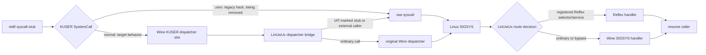

# Syscall routing: goal and invariants

This is the permanent design spec for how LinUwUx routes a game's Windows
syscalls on Linux. It states the target behavior; see
[`topspin-investigation.md`](topspin-investigation.md) for the one open
compatibility issue currently blocking full compliance with it, and
[`game-quirks.md`](game-quirks.md) for the per-title protocol differences
this design has to accommodate.

## Goal

Run Reflex's intended syscall checks and routing on Linux **without
modifying `KUSER_SHARED_DATA.SystemCall`**. Calls that Reflex handles
specially must reach the corresponding LinUwUx/Reflex handler. Calls that
Reflex bypasses must reach Wine's existing syscall handler with the same
request, return behavior, and caller-visible machine state as Wine's direct
ntdll syscall path.

This must hold across games and runs. Runtime addresses vary between runs, so
routing decisions must come from runtime registration and captured
trampoline/IAT metadata, never from fixed game addresses or one game's
disassembly.

## Current path

The legacy `LINUWUX_SYSCALL_HACK` path only changes the first decision: it
makes Wine's ntdll stub take its direct `syscall` branch, skipping the KUSER
dispatcher call and LinUwUx's KUSER dispatcher bridge. Linux SIGSYS
interposition remains active either way. In the normal KUSER mode, the
bridge selects a raw syscall replay for an IAT-marked stub, or for an
unmarked stub whose caller is outside Wine's image range. SIGSYS then makes
a separate decision to route to a registered Reflex target or forward to
Wine.

## Required behavior and invariants

1. **Preserve Wine's normal semantics by default.** Unknown or unregistered
   syscalls must use Wine's original dispatcher/handler. LinUwUx must not
   reimplement file, virtual-memory, or handle services merely to imitate
   forwarding.
2. **Make Reflex decisions from runtime data.** Use registered syscall IDs,
   callback targets, selectors, and captured trampoline/IAT metadata. Do not
   depend on fixed caller addresses, fixed module load addresses, or a
   single title's selector list.
3. **Keep selection separate from handling.** A captured Reflex IAT stub is
   evidence to replay through the raw syscall instruction; it is not itself
   proof that Reflex handles that service. The registered route and selector
   checks decide that.
4. **Match the direct syscall ABI on bypass.** At Wine's handler and on
   return, preserve the effective request arguments and outputs, stack
   pointer and top-of-stack return address, RIP, RAX/service, R10,
   R11/EFLAGS, caller GPRs, and relevant XMM state. Account explicitly for
   the KUSER call's extra stack word and for flags changed by the stub's
   `TEST` and any replay/rewind.
5. **Consume bridge state exactly once.** Bridge markers must be matched to
   the correct thread, raw syscall RIP, and stack pointer, and cleared on
   handled, bypassed, failed, and resumed paths. A marker must not leak into
   a later syscall at a reused stack depth.
6. **Keep diagnostics bounded.** An opt-in trace profile should capture a
   small number of events from the selected game process, with the route
   decision and before/after state at the boundaries above. Ordinary
   launches must not emit per-syscall or per-helper-process logs.

## Boundaries in source

Three independent decisions, each owned by its own module (see
`docs/ARCHITECTURE.md` for the current file layout):

| Boundary | Job | Evidence used |
| --- | --- | --- |
| KUSER shared data | Install the LinUwUx dispatcher bridge in the KUSER dispatcher slot. | None — this is unconditional once Reflex is detected, with no per-call decision. |
| KUSER dispatcher bridge | Keep ordinary Wine calls on Wine's dispatcher; replay IAT-marked stubs and unmarked raw stubs from outside Wine's image range. | Captured Reflex IAT stub addresses, caller table, copied stub service number/opcode, caller image ranges. |
| SIGSYS interposer | Forward ordinary Wine syscalls to Wine; for bridged calls, try registered Reflex routing and either jump to its target or forward. | Bridge marker keyed by raw syscall RSP/RIP, XMM5 bypass magic, RAX service, R10/RCX constraints, registration state and targets. |

## Wine window-list size-probe exception

Some Wine builds can return success from `NtUserBuildHwndList` when the caller
passes a zero-capacity, null output buffer and the server reports no windows.
The implementation then writes the mandatory `HWND_BOTTOM` terminator through
that null pointer. NBA 2K25 reaches this path through a Reflex bypass; the
captured request has the null buffer before LinUwUx emulates `int 2e`, and the
arguments remain unchanged at SIGSYS.

For this one request, after Reflex has chosen bypass, LinUwUx writes a minimum
required size of one and returns `STATUS_BUFFER_TOO_SMALL`. The caller can
allocate and retry; Wine still handles the retry and every other request.
The service ID is resolved from the loaded Wine `win32u.dll` export rather
than fixed to the value observed in one Proton build. If discovery or the
output write fails, the call falls through to Wine unchanged. This workaround
has unit coverage but still needs a game run to confirm that it removes the
Wine fault and the later game exception.

## Terms

- **KUSER route:** The syscall stub calls the dispatcher pointer in
  `KUSER_SHARED_DATA` before reaching the kernel syscall instruction.
- **Direct route:** The stub reaches `syscall` without the extra KUSER
  dispatcher call (either via the legacy hack, or via a raw-syscall replay
  from the bridge).
- **Reflex replay/bypass:** Reflex marks an ordinary selector and replays
  the syscall so Wine can handle it. This is distinct from a selector
  handled by one of Reflex's custom callbacks.
- **Dispatcher return boundary:** The trace point after Wine has handled the
  syscall and execution returns to the ntdll syscall stub. Matching state at
  this point does not guarantee identical execution later in the caller.

## Out of scope

- Treating any one game's disassembled addresses as permanent route keys.
- Reproducing arbitrary Wine syscalls inside LinUwUx.
- Assuming that matching syscall status/output proves identical continuation
  state.
- Adding uncoordinated environment variables or unbounded SIGSYS logs.
